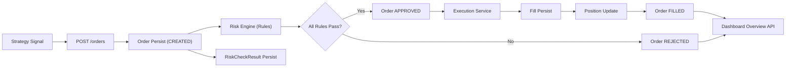

# Quant Execution Risk Platform (QERP)

QERP는 정량 전략 주문을 **리스크 통제 하에서 실행**하고, 체결/포지션까지 일관되게 추적하기 위한 백엔드 중심 플랫폼이다.

현재 저장소는 Java 운영 서비스와 Python 리서치 영역을 분리한 모노레포로 운영된다.

## 1. System Objective

핵심 목표는 아래 4가지다.

1. 전략 실행 컨텍스트(`StrategyRun`)에서 주문(`Order`)을 생성하고 영속화한다.
2. 주문 직후 룰 기반 리스크 평가를 수행해 승인/거절을 결정한다.
3. 승인 주문은 실행 단계로 연결하여 체결(`Fill`)과 포지션(`Position`)을 갱신한다.
4. 전 과정을 DB/Flyway 기반으로 감사 가능하게 남기고, 대시보드에서 확인 가능하게 한다.

## 2. Repository Layout

```text
quant-execution-risk-platform/
  java-service/         # 운영 백엔드 (Spring Boot, JPA, Flyway)
  python-research/      # 전략 연구/실험 영역 (오프라인 분석)
  docs/                 # 아키텍처/범위/ERD 문서
  compose.yml           # 로컬 PostgreSQL
```

## 3. Technology Stack

### Java Service

- Java 17+ / Spring Boot 3.5
- Spring Web
- Spring Data JPA
- PostgreSQL
- Flyway
- Gradle
- Lombok

### Python Research

- 전략 실험/백테스트/분석용 영역 (운영 트랜잭션 책임 없음)

## 4. Current Delivery Status (as of 2026-03-30)

### Delivered

1. Spring Boot + Gradle 서비스 부트스트랩
2. 도메인 엔티티: `Instrument`, `MarketPrice`, `StrategyRun`, `Order`, `RiskCheckResult`, `Fill`, `Position`
3. `POST /orders` 주문 API
4. 리스크 엔진 스켈레톤 및 2개 룰
   - 최대 주문 수량 한도
   - 종목별 수량 노출 한도
5. 주문 상태 전이
   - `CREATED -> APPROVED/REJECTED`
   - 승인 주문 실행 후 `FILLED`
6. 체결/포지션 최소 구현
   - `fill` 적재
   - `position` upsert
7. Flyway 마이그레이션
   - `V1` core schema
   - `V2` risk check results
   - `V3` fill/position
8. 진행상황 웹 대시보드
   - `/` 정적 UI
   - `/dashboard/overview` 집계 API

### Not Yet Delivered

1. `PortfolioSnapshot`
2. 현금/계좌 기반 리스크
3. 실거래 어댑터 및 고급 실행 로직
4. 실시간 스트리밍/메시지 브로커
5. 인증/권한

## 5. Runtime Lifecycle

1. 애플리케이션 시작
2. Flyway migration 적용 (V1~V3)
3. JPA schema validate
4. API 요청 처리 시작
5. 주문 라이프사이클
   1. `POST /orders`
   2. `Order(status=CREATED)` 저장
   3. 리스크 룰 평가 및 `risk_check_result` 저장
   4. 통과 시 `APPROVED`, 실패 시 `REJECTED`
   5. `APPROVED` 주문은 실행 서비스에서 즉시 체결 처리
   6. `fill` 저장
   7. `position` 갱신
   8. 주문 최종 상태 `FILLED`
6. 대시보드/조회 API에서 현재 상태 확인

## 6. High-Level Architecture



## 7. Database Governance

- 스키마 변경은 Flyway만 사용
- JPA는 `ddl-auto: validate`로 매핑 검증만 수행
- 주요 무결성
  - PK/FK
  - `orders(strategy_run_id, client_order_id)` unique
  - `fill(order_id)` unique
  - `position(strategy_run_id, instrument_id)` unique

## 8. Web Progress Dashboard

### Endpoints

- `GET /` : 진행상황 UI
- `GET /dashboard/overview?limit=20` : 주문/리스크/체결/포지션 집계
- `POST /orders` : 주문 생성

### Dashboard Purpose

- 현재 구현 상태를 사람이 즉시 검증 가능한 형태로 제공
- 주문 생성 -> 리스크 판정 -> 체결 -> 포지션 반영까지 한 화면에서 추적


## 9. Documentation Index

- [System Architecture](docs/system-architecture.md)
- [MVP Scope and Status](docs/mvp.md)
- [ERD Draft](docs/erd-draft.md)

## 10. 프로젝트 정밀 분석 (Repository Deep Analysis)

이 섹션은 현재 코드베이스(루트, `java-service`, `python-research`, `docs`)를 기준으로 실제 구현 상태를 상세하게 정리한 분석 문서다.

### 10.1 저장소의 실제 역할과 경계

- 저장소는 운영 백엔드(`java-service`)와 리서치 공간(`python-research`)을 분리한 구조다.
- 운영 트랜잭션(주문/리스크/체결/포지션/시장데이터 수집)은 Java 서비스가 담당한다.
- Python 리서치 영역은 현재 `.gitkeep`만 존재하며, 운영 로직은 포함하지 않는다.
- `docs`는 아키텍처/범위/ERD의 의도와 경계를 명시하고, 실제 구현은 Java 코드와 Flyway SQL이 기준 소스다.

### 10.2 Java 서비스 아키텍처 (실구현 기준)

#### 애플리케이션 부팅과 인프라

- `JavaServiceApplication`은 `@EnableScheduling`을 사용하므로, 시장데이터 수집 스케줄이 런타임에서 활성화 가능하다.
- DB 스키마는 Flyway(`spring.flyway.enabled: true`, `classpath:db/migration`)로 관리되고, JPA는 `ddl-auto: validate`로 검증만 수행한다.
- 로컬 DB 표준은 `compose.yml`의 PostgreSQL 16 (`postgres:16`, `5432`)이다.

#### 계층 구조

1. API Layer
   - `OrderController` (`POST /orders`)
   - `DashboardController` (`GET /dashboard/overview`, `GET /dashboard/options`, `POST /dashboard/seed-demo`)
   - `MarketDataController` (`GET /market-data/status`, `POST /market-data/ingest`)
2. Application Service Layer
   - `OrderService` (주문 생성 오케스트레이션)
   - `RiskEvaluationService` (리스크 룰 평가 및 결과 영속화)
   - `OrderExecutionService` (승인 주문 실행, Fill/Position 반영)
   - `DashboardService` (운영 집계/옵션/데모데이터)
   - `MarketDataIngestionService` / `MarketDataStatusService` (시장 데이터 수집 및 상태)
3. Domain/Persistence Layer
   - 엔티티: `Instrument`, `MarketPrice`, `StrategyRun`, `Order`, `RiskCheckResult`, `Fill`, `Position`
   - 저장소: 각 도메인별 Spring Data JPA Repository
4. Static UI Layer
   - `/` 에서 정적 대시보드 UI(`static/index.html`, `app.js`, `app.css`) 제공

### 10.3 주문 도메인: 상태기계와 트랜잭션 경로

#### 입력 계약

`CreateOrderRequest` 검증 제약:
- `strategyRunId`, `instrumentId`, `side`, `quantity`, `orderType`는 `@NotNull`
- `quantity`는 `@DecimalMin("0.000001")`
- `clientOrderId`는 `@NotBlank`, `@Size(max=64)`

#### 주문 처리 순서 (`OrderService#createOrder`, `@Transactional`)

1. `strategyRunId`/`instrumentId` 존재 검증
   - 미존재 시 `400 Bad Request` (`ResponseStatusException`)
2. `Order(status=CREATED)` 저장
3. `RiskEvaluationService` 호출
4. `OrderExecutionService` 호출
5. 최종 상태를 포함한 `CreateOrderResponse` 반환

#### 상태 전이의 실제 구현

- 초기: `CREATED`
- 리스크 전체 통과: `APPROVED`
- 리스크 1개라도 실패: `REJECTED`
- `APPROVED` 주문 실행 완료: `FILLED`

### 10.4 리스크 엔진: 규칙 기반 평가 + 감사 추적

`RiskEvaluationService`는 등록된 `List<RiskRule>`를 순회하며 각 결과를 `risk_check_result`에 반드시 적재한다.

구현된 규칙:
1. `MaxOrderQuantityRiskRule`
   - 설정값 `risk.max-order-quantity`(기본 1000) 기준으로 단일 주문 수량 제한
2. `InstrumentQuantityExposureRiskRule`
   - 동일 종목의 누적 승인/체결 수량 + 현재 주문 수량이
     `risk.max-instrument-quantity`(기본 2000)를 초과하는지 평가

의미:
- “왜 주문이 거절되었는지”가 rule 단위 메시지로 DB에 남아 사후분석/감사 가능성이 높다.

### 10.5 실행/체결/포지션: MVP 실행모델의 핵심 로직

`OrderExecutionService`는 `APPROVED` 주문만 실행한다.

#### 체결 가격 결정

1. 우선순위: `market_price` 최신 종가 조회  
   (`findFirstByInstrumentIdOrderByPriceDateDescIdDesc`)
2. 없으면 fallback: `execution.default-fill-price` (기본 `1.000000`)

참고: 메서드명의 `...PriceDateDescIdDesc`는 동일 날짜 데이터에서 `id DESC`로 최신 레코드를 추가 tie-break 하도록 의도된 구현이다.

#### Fill 처리

- 주문당 1건 체결을 생성 (`fill` 저장)
- DB 유니크 제약: `uk_fill_order_id` (order_id unique)

#### Position upsert

- 키: `(strategy_run_id, instrument_id)`
- BUY:
  - 수량 증가
  - 가중평균단가 재계산 (`scale=6`, `HALF_UP`)
- SELL:
  - 수량 감소
  - 수량이 0 이하가 되면 평균단가 0으로 초기화

### 10.6 시장 데이터 수집: 운영 보조 파이프라인

`MarketDataIngestionService`는 Finnhub Quote API를 호출해 `market_price`를 upsert한다.

- 스케줄: `@Scheduled(fixedDelayString = "${market-data.poll-ms:60000}")`
- 활성 조건:
  - `market-data.enabled=true`
  - `market-data.api-key` 설정
- 수동 실행: `POST /market-data/ingest` (응답 202)
- 상태 조회: `GET /market-data/status`
- API 키 미설정 시 실패로 처리하지 않고 운영 상태에 명시적 메시지 기록:
  - `"market-data.api-key is not configured"`

### 10.7 대시보드: 운영 상태 가시성 계층

`DashboardService`는 `JdbcTemplate` 기반 SQL 집계를 통해 아래를 제공한다.

1. `GET /dashboard/overview`
   - 주문 상태 카운트/비율
   - 최근 주문/리스크체크/체결/포지션 목록
   - `limit` 파라미터는 1~100으로 정규화
2. `GET /dashboard/options`
   - 전략 실행 옵션
   - 종목 옵션 + 최신 종가(LEFT JOIN LATERAL로 최신 레코드 조회)
3. `POST /dashboard/seed-demo`
   - 데모 종목/가격/전략실행 데이터 생성

의미:
- 운영자 관점에서 “주문 생성→판정→체결→포지션”의 end-to-end 상태를 즉시 점검할 수 있다.

### 10.8 예외/오류 모델

`GlobalExceptionHandler`가 일관된 `ApiErrorResponse`를 반환한다.

- `ResponseStatusException` → 해당 HTTP 상태로 매핑
- `MethodArgumentNotValidException` → 첫 필드 에러를 `"field: message"`로 반환
- 그 외 예외 → `500`, `"Unexpected server error"`

응답 구조:
- `timestamp`, `status`, `error`, `message`, `path`

### 10.9 DB 마이그레이션/무결성 분석

Flyway 버전:

- `V1__init_mvp_schema.sql`
  - `instrument`, `strategy_run`, `market_price`, `orders`
  - `orders(strategy_run_id, client_order_id)` unique
- `V2__add_risk_check_result_table.sql`
  - `risk_check_result` + `order_id` index
- `V3__add_fill_and_position_tables.sql`
  - `fill` (order unique), `position` (strategy_run+instrument unique)
- `V4__enforce_market_price_uniqueness.sql`
  - `market_price` 중복 정리 후 `(instrument_id, price_date)` unique 추가

핵심 무결성의 의미:
- 주문 idempotency(전략 실행 단위 client_order_id 중복 방지)
- 주문-체결 1:1 보장(MVP 가정)
- 포지션 upsert 키 보장(전략실행+종목 단위 단일 포지션)
- 일자별 종가 데이터 중복 방지

### 10.10 테스트 커버리지의 실제 범위

현재 테스트는 `OrderControllerIntegrationTest` 1개 클래스이며, Testcontainers(PostgreSQL 16) 기반 통합 테스트로 구성되어 있다.

검증 범위:
- 정상 주문 생성 시 `FILLED`, Fill/Position 생성
- `clientOrderId` 중복 충돌(409)
- 리스크 초과 주문 `REJECTED` + Fill 미생성
- 미존재 `strategyRunId`에 대한 400
- 시장데이터 API 키 미설정 처리
- 시장데이터 상태 API 결과 노출

해석:
- 핵심 주문 라이프사이클은 통합수준에서 검증되고 있으나,
- Dashboard API의 상세 케이스, Rule 단위 unit test, 동시성/성능 테스트는 확장 여지가 있다.

### 10.11 운영/실행 관점 종합 평가

현재 QERP는 “운영 최소 경로(MVP)”를 실제 코드와 DB 제약으로 일관되게 완성했다.

강점:
- 주문-리스크-실행-체결-포지션의 end-to-end 연결이 단일 트랜잭션 흐름으로 명확함
- 리스크 판정 결과의 감사 추적성이 높음
- Flyway + validate 전략으로 스키마 거버넌스가 안정적임
- 대시보드와 시장데이터 상태 API로 운영 가시성이 확보됨

남은 과제(코드 기준):
- PortfolioSnapshot 미구현
- 부분체결/슬리피지/고급 실행 정책 미구현
- 현금/계좌 기반 리스크 및 인증/권한 미구현
- 비동기 메시지 기반 확장(고부하 대응) 미도입

결론:
- 본 저장소는 “실거래 확장 전 단계의 정량 주문 실행 리스크 플랫폼 MVP”로서 구조적 일관성과 확장 포인트를 모두 확보한 상태다.
