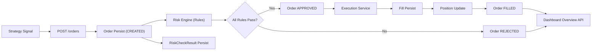

# Quant Execution Risk Platform (QERP)

QERP는 정량 전략 주문을 **리스크 통제 하에서 실행**하고, 체결/포지션까지 일관되게 추적하기 위한 백엔드 중심 플랫폼이다.

현재 저장소는 Java 운영 서비스와 Python 리서치 영역을 분리한 모노레포로 운영된다.

## 1. System Objective

핵심 목표는 아래 4가지다.

1. 전략 실행 컨텍스트(`StrategyRun`)에서 주문(`Order`)을 생성하고 영속화한다.
2. 주문 직후 룰 기반 리스크 평가를 수행해 승인/거절을 결정한다.
3. 승인 주문은 실행 단계로 연결하여 체결(`Fill`)과 포지션(`Position`)을 갱신한다.
4. 전 과정을 DB/Flyway 기반으로 감사 가능하게 남기고, 대시보드에서 확인 가능하게 한다.

## 2. Repository Layout

```text
quant-execution-risk-platform/
  java-service/         # 운영 백엔드 (Spring Boot, JPA, Flyway)
  python-research/      # 전략 연구/실험 영역 (오프라인 분석)
  docs/                 # 아키텍처/범위/ERD 문서
  compose.yml           # 로컬 PostgreSQL
```

## 3. Technology Stack

### Java Service

- Java 17+ / Spring Boot 3.5
- Spring Web
- Spring Data JPA
- PostgreSQL
- Flyway
- Gradle
- Lombok

### Python Research

- 전략 실험/백테스트/분석용 영역 (운영 트랜잭션 책임 없음)

## 4. Current Delivery Status (as of 2026-03-30)

### Delivered

1. Spring Boot + Gradle 서비스 부트스트랩
2. 도메인 엔티티: `Instrument`, `MarketPrice`, `StrategyRun`, `Order`, `RiskCheckResult`, `Fill`, `Position`
3. `POST /orders` 주문 API
4. 리스크 엔진 스켈레톤 및 2개 룰
   - 최대 주문 수량 한도
   - 종목별 수량 노출 한도
5. 주문 상태 전이
   - `CREATED -> APPROVED/REJECTED`
   - 승인 주문 실행 후 `FILLED`
6. 체결/포지션 최소 구현
   - `fill` 적재
   - `position` upsert
7. Flyway 마이그레이션
   - `V1` core schema
   - `V2` risk check results
   - `V3` fill/position
8. 진행상황 웹 대시보드
   - `/` 정적 UI
   - `/dashboard/overview` 집계 API

### Not Yet Delivered

1. `PortfolioSnapshot`
2. 현금/계좌 기반 리스크
3. 실거래 어댑터 및 고급 실행 로직
4. 실시간 스트리밍/메시지 브로커
5. 인증/권한

## 5. Runtime Lifecycle

1. 애플리케이션 시작
2. Flyway migration 적용 (V1~V3)
3. JPA schema validate
4. API 요청 처리 시작
5. 주문 라이프사이클
   1. `POST /orders`
   2. `Order(status=CREATED)` 저장
   3. 리스크 룰 평가 및 `risk_check_result` 저장
   4. 통과 시 `APPROVED`, 실패 시 `REJECTED`
   5. `APPROVED` 주문은 실행 서비스에서 즉시 체결 처리
   6. `fill` 저장
   7. `position` 갱신
   8. 주문 최종 상태 `FILLED`
6. 대시보드/조회 API에서 현재 상태 확인

## 6. High-Level Architecture



## 7. Database Governance

- 스키마 변경은 Flyway만 사용
- JPA는 `ddl-auto: validate`로 매핑 검증만 수행
- 주요 무결성
  - PK/FK
  - `orders(strategy_run_id, client_order_id)` unique
  - `fill(order_id)` unique
  - `position(strategy_run_id, instrument_id)` unique

## 8. Web Progress Dashboard

### Endpoints

- `GET /` : 진행상황 UI
- `GET /dashboard/overview?limit=20` : 주문/리스크/체결/포지션 집계
- `POST /orders` : 주문 생성

### Dashboard Purpose

- 현재 구현 상태를 사람이 즉시 검증 가능한 형태로 제공
- 주문 생성 -> 리스크 판정 -> 체결 -> 포지션 반영까지 한 화면에서 추적


## 9. Documentation Index

- [System Architecture](docs/system-architecture.md)
- [MVP Scope and Status](docs/mvp.md)
- [ERD Draft](docs/erd-draft.md)


