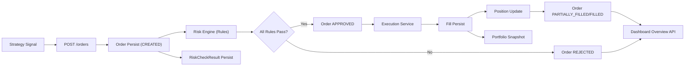

# Quant Execution Risk Platform (QERP)

QERP는 정량 전략 주문을 리스크 통제 하에서 생성, 승인, 실행하고 체결과 포지션, 포트폴리오 스냅샷까지 추적하는 백엔드 중심 플랫폼이다.

현재 저장소는 Java 운영 서비스와 Python 리서치 공간을 분리한 모노레포다.

## 1. System Objective

핵심 목표는 아래 4가지다.

1. 전략 실행 컨텍스트(`StrategyRun`)에서 주문(`Order`)을 생성하고 영속화한다.
2. 주문 직후 룰 기반 리스크 평가를 수행해 승인/거절을 결정한다.
3. 승인 주문은 실행 단계로 연결하여 체결(`Fill`)과 포지션(`Position`)을 갱신한다.
4. 체결 이후 포트폴리오 스냅샷(`PortfolioSnapshot`)을 적재하고 대시보드에서 조회 가능하게 한다.

## 2. Repository Layout

```text
quant-execution-risk-platform/
  java-service/         # 운영 백엔드 (Spring Boot, JPA, Flyway)
  python-research/      # 전략 연구/실험 영역
  docs/                 # 아키텍처/범위/ERD/핸드오버 문서
  compose.yml           # 로컬 PostgreSQL 16
```

## 3. Technology Stack

### Java Service

- Java 17+
- Spring Boot 3.5
- Spring Web
- Spring Data JPA
- PostgreSQL
- Flyway
- Gradle
- Lombok
- Testcontainers

### Python Research

- 현재는 리서치용 placeholder 영역만 존재

## 4. Current Delivery Status (as of 2026-04-04)

### Delivered

1. Spring Boot + Gradle 서비스 부트스트랩
2. 도메인 엔티티
   - `Instrument`
   - `MarketPrice`
   - `StrategyRun`
   - `Order`
   - `RiskCheckResult`
   - `Fill`
   - `Position`
   - `PortfolioSnapshot`
3. 주문 API
   - `POST /orders`
4. 리스크 엔진 및 구현 룰 2개
   - 최대 주문 수량 한도
   - 종목별 signed quantity exposure 한도
5. 주문 상태 전이
   - `CREATED -> APPROVED/REJECTED`
   - 실행 후 `PARTIALLY_FILLED` 또는 `FILLED`
6. 실행/체결/포지션 구현
   - MARKET 주문은 데모 목적상 2개 fill 청크로 분할 저장
   - LIMIT 주문은 최신 종가 기준 조건 충족 시 1회 fill
   - 주문별 `filled_quantity`, `remaining_quantity`, `last_executed_at` 추적
7. 포트폴리오 스냅샷
   - 체결 시 자동 생성
   - `POST /dashboard/portfolio-snapshots/refresh` 수동 갱신
   - `realized_pnl`, `unrealized_pnl`, `total_pnl`, `return_rate` 계산
8. 진행상황 웹 대시보드
   - `/` 정적 UI
   - `/dashboard/overview`
   - `/dashboard/options`
   - `/dashboard/seed-demo`
9. 외부 시장 데이터 수집
   - `POST /market-data/ingest`
   - `GET /market-data/status`
   - 설정 기반 스케줄 실행
10. Flyway 마이그레이션
   - `V1` core schema
   - `V2` risk check results
   - `V3` fill/position
   - `V4` market price uniqueness
   - `V5` order execution lifecycle
   - `V6` limit price
   - `V7` portfolio snapshot

### Not Yet Delivered

1. 현금/계좌 기반 리스크
2. 실거래 브로커 어댑터 및 고급 실행 정책
3. 인증/권한
4. 메시지 브로커 기반 비동기 파이프라인
5. 숏 포지션/고급 실현손익 정책의 정교화

## 5. Local Run

### Prerequisites

- Java 17 이상
- Docker Desktop

### 5.1 PostgreSQL 실행

저장소 루트에서 실행:

```powershell
docker compose -f compose.yml up -d
```

기본 접속 정보:

- DB: `qerp`
- User: `postgres`
- Password: `postgres`
- Port: `5432`

### 5.2 Java 서비스 실행

PowerShell:

```powershell
cd java-service
.\gradlew.bat bootRun
```

macOS/Linux:

```bash
cd java-service
./gradlew bootRun
```

기본 환경변수는 아래 값으로 동작한다.

- `DB_HOST=localhost`
- `DB_PORT=5432`
- `DB_NAME=qerp`
- `DB_USERNAME=postgres`
- `DB_PASSWORD=postgres`
- `SERVER_PORT=8080`

옵션:

- `FINNHUB_API_KEY`를 설정하면 시장데이터 수집 API 사용 가능
- `market-data.enabled=true`로 실행하면 스케줄 수집 활성화 가능

### 5.3 테스트 실행

```powershell
cd java-service
.\gradlew.bat test
```

테스트는 Testcontainers 기반 PostgreSQL을 사용하므로 Docker가 필요하다.

### 5.4 접속 URL

- Dashboard UI: `http://localhost:8080/`
- Dashboard Overview API: `http://localhost:8080/dashboard/overview`
- Market Data Status API: `http://localhost:8080/market-data/status`

## 6. Runtime Lifecycle

1. 애플리케이션 시작
2. Flyway migration 적용 (`V1` ~ `V7`)
3. JPA schema validate
4. API 요청 처리 시작
5. 주문 라이프사이클
   1. `POST /orders`
   2. `Order(status=CREATED)` 저장
   3. 리스크 룰 평가 및 `risk_check_result` 저장
   4. 통과 시 `APPROVED`, 실패 시 `REJECTED`
   5. `APPROVED` 주문은 실행 서비스로 전달
   6. 실행 정책에 따라 1회 이상 `fill` 생성
   7. 각 `fill`마다 `position` 갱신
   8. 주문 상태를 `PARTIALLY_FILLED` 또는 `FILLED`로 갱신
6. 체결 발생 시 포트폴리오 스냅샷 생성
7. 대시보드와 조회 API에서 현재 상태 확인

## 7. High-Level Architecture



## 8. Main API Endpoints

- `POST /orders`
- `GET /dashboard/overview?limit=20`
- `GET /dashboard/options`
- `POST /dashboard/seed-demo`
- `POST /dashboard/portfolio-snapshots/refresh`
- `GET /market-data/status`
- `POST /market-data/ingest`

## 9. Database Governance

- 스키마 변경은 Flyway만 사용
- JPA는 `ddl-auto: validate`로 매핑 검증만 수행
- 주요 무결성
  - `orders(strategy_run_id, client_order_id)` unique
  - `position(strategy_run_id, instrument_id)` unique
  - `market_price(instrument_id, price_date)` unique
  - `fill(order_id)`는 unique 아님

## 10. Notes

- 포트폴리오 지표는 현재 `position + latest market_price + fill history` 기준 MVP 계산이다.
- SELL 주문은 종목 노출 감소 방향으로 평가되도록 signed exposure 기준으로 리스크 계산한다.
- 숏 포지션 회계 정책은 아직 단순화되어 있으므로 고급 포트폴리오 분석 단계에서 보완이 필요하다.

## 11. Documentation Index

- [System Architecture](docs/system-architecture.md)
- [MVP Scope and Status](docs/mvp.md)
- [ERD Draft](docs/erd-draft.md)
- [AI Handover Analysis](docs/ai-handover-analysis.md)
- [Repository Deep Analysis](docs/Repository%20Deep%20Analysis)
