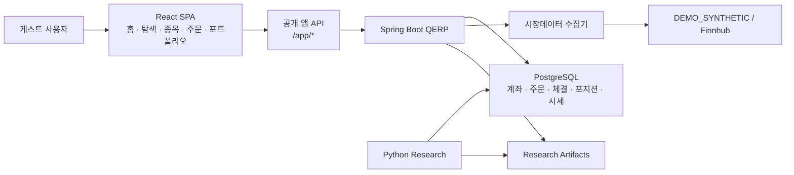
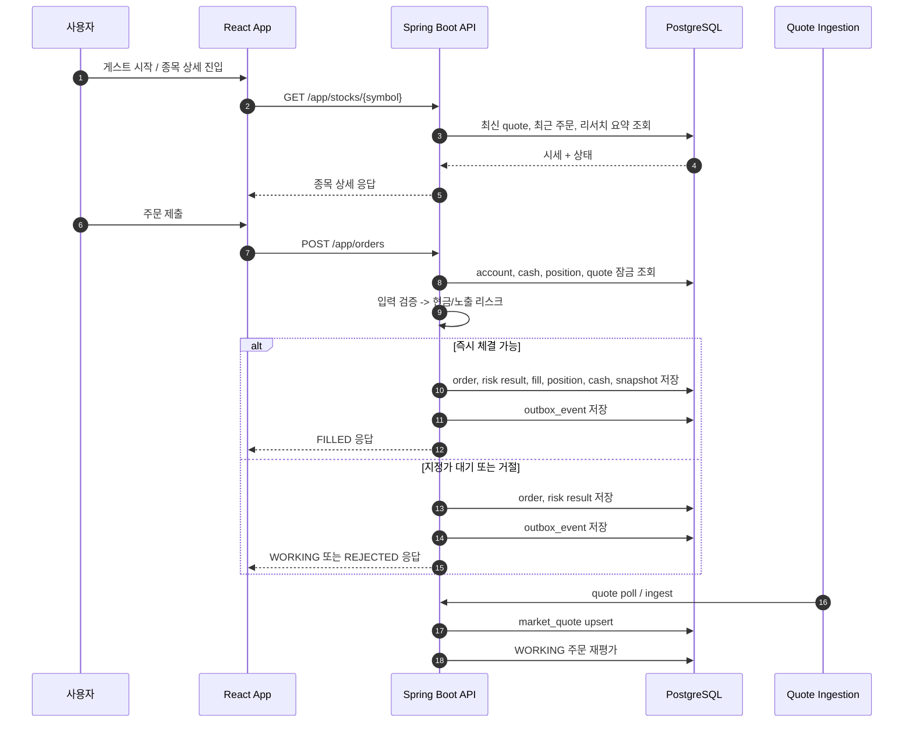
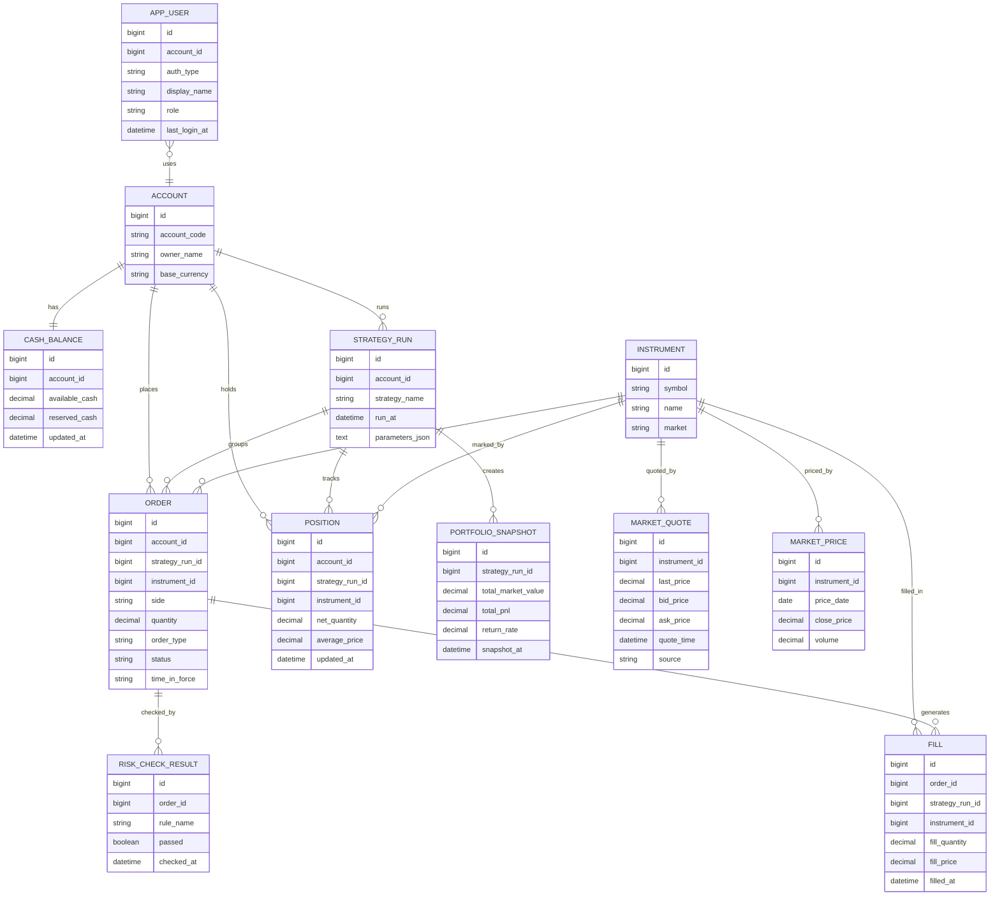

# QERP

QERP는 `실시간 시세 기반 paper trading 투자앱 + 공개 퀀트 모드`를 제공하는 데모 서비스다.  
메인 사용자 흐름은 `홈 -> 게스트 세션 시작 -> 종목 상세 -> 주문 -> 포트폴리오 -> 주문 상세`다.

백엔드는 Spring Boot가 주문, 리스크, 체결, 포지션, 현금, outbox, 시세 수집을 담당하고, 프론트는 React SPA가 일반 투자자용 화면을 제공한다. Python 리서치는 별도 패키지로 유지하며, 생성된 artifact를 퀀트 화면에서 조회한다.

## 주요 기능

- 게스트 세션 기반 즉시 체험
- 실시간 quote 기반 시장가/지정가 paper trading
- 현금, 포지션, 포트폴리오 스냅샷 자동 반영
- 대기 주문(`WORKING`)과 시세 변화 연동
- 퀀트 인사이트 및 리서치 artifact 조회

## 기술 구성

### Backend

- Spring Boot 3.5
- PostgreSQL + Flyway
- JWT 인증
- 게스트 세션 기반 `app_user`
- 주문/리스크/체결/포지션/현금/스냅샷 도메인
- DB outbox 기반 후속 처리
- Micrometer + Prometheus + Actuator
- React SPA 정적 산출물 서빙

### Frontend

- Vite + React + TypeScript
- React Router + TanStack Query
- Recharts + Plotly
- 소비자 투자앱 화면:
  - `/`
  - `/discover`
  - `/stocks/:symbol`
  - `/portfolio`
  - `/portfolio/orders/:id`
  - `/orders`
  - `/quant`
  - `/profile`

### Research

- Python 3.11
- `pandas`, `numpy`, `sqlalchemy`, `pyyaml`, `plotly`
- PostgreSQL `market_price` 조회
- `volatility-targeted moving average crossover`
- artifact 기반 결과 연동

## 구조 다이어그램

### 1. 시스템 컨텍스트



공개 앱, 시세 수집, 리서치 결과 조회가 하나의 서비스와 데이터베이스 위에서 연결되는 구조다.

### 2. 핵심 런타임 라이프사이클



이 라이프사이클의 핵심은 `quote -> order -> risk -> execution -> position/cash -> snapshot -> outbox`가 같은 데이터 모델 안에서 일관되게 이어진다는 점이다.

### 3. 핵심 ERD



`outbox_event`는 여러 aggregate의 후속 처리 이벤트를 담는 다형적 테이블이라 ERD에서는 단순화했고, 런타임 라이프사이클에서 별도로 표현했다.

## 실행 방법

### 1. GitHub에서 내려받아 바로 실행

사전 준비:

- Docker Desktop 또는 Docker Engine + Docker Compose
- 사용 가능한 포트 `8080`, `9090`, `5432`

```bash
git clone https://github.com/Bonchang/quant-execution-risk-platform_V1.git
cd quant-execution-risk-platform_V1
docker compose up -d --build
```

실행 후:

- 앱: [http://localhost:8080](http://localhost:8080)

첫 진입 후 `게스트로 시작`을 누르면 바로 paper trading 데모를 체험할 수 있다.

### 2. 가장 빠른 실행

```bash
docker compose up -d --build
```

`compose.yml`은 `local` 프로필로 Java 서비스를 띄우며, 데모 시세는 `DEMO_SYNTHETIC` 모드로 자동 갱신된다.

초기화/종료:

```bash
docker compose down
docker compose down -v
```

문제 확인:

```bash
docker compose logs -f java-service
```

### 3. Java 단독 실행

```bash
cd java-service
./gradlew bootRun --args='--spring.profiles.active=local'
```

### 4. Frontend 개발 서버

```bash
cd frontend
npm ci
npm run dev
```

Vite dev server는 `http://localhost:5173`에서 동작하며 `/app`, `/auth`, `/dashboard`, `/orders`, `/market-data`, `/research` 등을 `localhost:8080`으로 프록시한다.

### 5. Python 리서치

```bash
cd python-research
python3 -m pip install -e .
python3 -m qerp_research.run_backtest --config configs/demo_strategy.yaml --artifacts-dir artifacts
```

## 데모 시나리오

### 공개 앱 시나리오

1. 홈 진입
2. `게스트로 시작`
3. 종목 상세에서 시세와 퀀트 인사이트 확인
4. 시장가 또는 지정가 주문
5. `/portfolio`, `/orders`에서 결과 확인
6. `/portfolio/orders/:id`에서 주문 상세 확인

## 핵심 API

### 공개 앱 API

- `POST /app/auth/guest`
- `GET /app/home`
- `GET /app/discover`
- `GET /app/stocks/{symbol}`
- `GET /app/portfolio`
- `GET /app/orders`
- `POST /app/orders`
- `GET /app/quant/overview`

상세 API, 배포 절차, 설계 문서는 `docs/`에서 별도로 관리한다.

## 문서

- 상세 설계, 배포, ADR 목록: [docs/README.md](docs/README.md)
