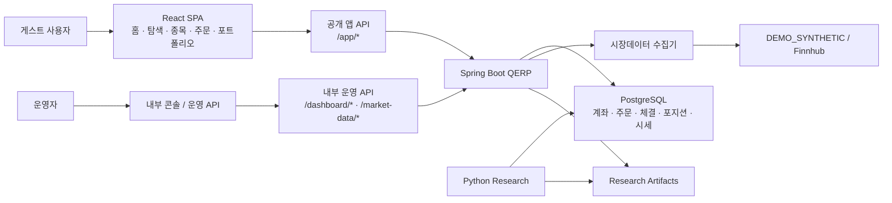
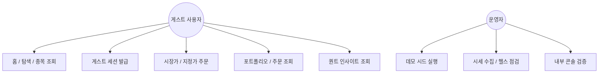
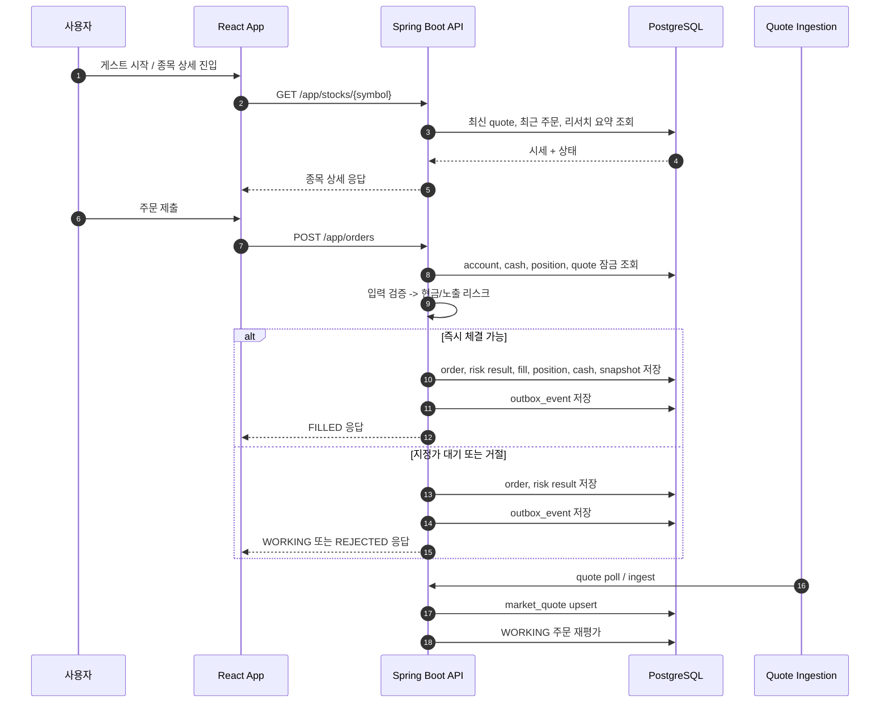
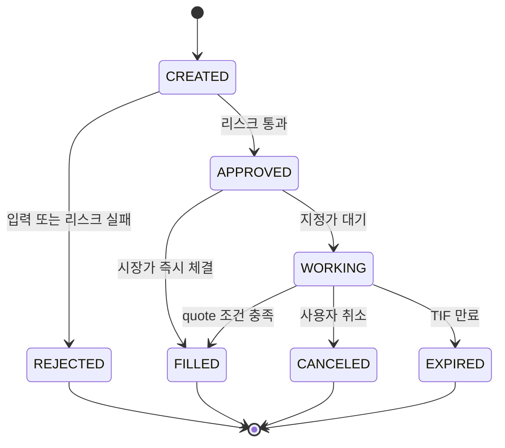

# QERP

QERP는 `실시간 시세 기반 paper trading 투자앱 + 공개 퀀트 모드`를 목표로 한 포트폴리오 프로젝트다.  
지금 기준 메인 경험은 `홈 -> 게스트 세션 시작 -> 종목 상세 -> 주문 -> 포트폴리오 -> 주문 상세` 흐름이다.

백엔드는 Spring Boot가 주문, 리스크, 체결, 포지션, 현금, outbox, 시세 수집을 담당하고, 프론트는 React SPA로 일반 투자자용 경험을 제공한다. Python 리서치는 별도 패키지로 유지하되, 결과 artifact를 앱의 퀀트 화면에 연결한다.

## 문제 정의

정량 전략 포트폴리오는 백테스트 숫자만으로 설득력이 생기지 않는다. 실제 서비스처럼 보이려면 아래가 함께 있어야 한다.

1. 계좌와 현금 기준으로 통제되는 주문 백엔드
2. 실시간 시세와 연결된 paper execution
3. 체결 후 포지션, 현금, 포트폴리오 스냅샷의 일관된 반영
4. 리서치 결과와 실제 주문 흐름을 같은 제품 안에서 보여주는 UI

QERP는 이 흐름을 `공개 가능한 데모 서비스` 수준까지 끌어올리는 것을 목표로 한다.

## 아키텍처

### Backend

- Spring Boot 3.5
- PostgreSQL + Flyway
- JWT 인증
- 게스트 세션 기반 `app_user`
- 주문/리스크/체결/포지션/현금/스냅샷 도메인
- DB outbox 기반 후속 처리
- Micrometer + Prometheus + Actuator
- React SPA 정적 산출물 서빙

### Frontend

- Vite + React + TypeScript
- React Router + TanStack Query
- Recharts + Plotly
- 소비자 투자앱 화면:
  - `/`
  - `/discover`
  - `/stocks/:symbol`
  - `/portfolio`
  - `/portfolio/orders/:id`
  - `/orders`
  - `/quant`
  - `/profile`

### Research

- Python 3.11
- `pandas`, `numpy`, `sqlalchemy`, `pyyaml`, `plotly`
- PostgreSQL `market_price` 조회
- `volatility-targeted moving average crossover`
- artifact 기반 결과 연동

## 구조 다이어그램

### 1. 시스템 컨텍스트



QERP는 `공개 소비자 앱`, `내부 운영 API`, `시장데이터 수집`, `리서치 아티팩트 조회`를 하나의 Spring Boot 서비스와 PostgreSQL 중심으로 묶는 구조다.

### 2. 주요 유스케이스



공개 사용자는 가입 없이 게스트 세션으로 paper trading을 체험하고, 운영자는 별도 API와 콘솔로 상태를 점검한다.

### 3. 핵심 런타임 라이프사이클



이 라이프사이클의 핵심은 `quote -> order -> risk -> execution -> position/cash -> snapshot -> outbox`가 같은 데이터 모델 안에서 일관되게 이어진다는 점이다.

### 4. 주문 상태머신



공개 데모의 핵심 사용자 경험은 `FILLED`, `WORKING`, `REJECTED` 세 상태를 중심으로 보이고, 내부적으로는 `APPROVED`가 리스크 통과 지점 역할을 한다.

### 5. 핵심 ERD


`outbox_event`는 여러 aggregate의 후속 처리 이벤트를 담는 다형적 테이블이라 ERD에서는 단순화했고, 런타임 라이프사이클에서 별도로 표현했다.

## 실행 방법

### 1. GitHub에서 내려받아 바로 실행

사전 준비:

- Docker Desktop 또는 Docker Engine + Docker Compose
- 사용 가능한 포트 `8080`, `9090`, `5432`

```bash
git clone https://github.com/Bonchang/quant-execution-risk-platform_V1.git
cd quant-execution-risk-platform_V1
docker compose up -d --build
```

실행 후:

- 앱: [http://localhost:8080](http://localhost:8080)
- Prometheus: [http://localhost:9090](http://localhost:9090)

첫 진입 후 `게스트로 시작`을 누르면 바로 paper trading 데모를 체험할 수 있다.

### 2. 가장 빠른 실행

```bash
docker compose up -d --build
```

`compose.yml`은 `local` 프로필로 Java 서비스를 띄우며, 데모 시세는 `DEMO_SYNTHETIC` 모드로 자동 갱신된다.

초기화/종료:

```bash
docker compose down
docker compose down -v
```

문제 확인:

```bash
docker compose logs -f java-service
```

### 3. Java 단독 실행

```bash
cd java-service
./gradlew bootRun --args='--spring.profiles.active=local'
```

### 4. Frontend 개발 서버

```bash
cd frontend
npm ci
npm run dev
```

Vite dev server는 `http://localhost:5173`에서 동작하며 `/app`, `/auth`, `/dashboard`, `/orders`, `/market-data`, `/research` 등을 `localhost:8080`으로 프록시한다.

### 5. Python 리서치

```bash
cd python-research
python3 -m pip install -e .
python3 -m qerp_research.run_backtest --config configs/demo_strategy.yaml --artifacts-dir artifacts
```

## 데모 시나리오

### 공개 데모 시나리오

1. 홈 진입
2. `게스트로 시작`
3. 종목 상세에서 시세와 퀀트 인사이트 확인
4. 시장가 또는 지정가 주문
5. `/portfolio`, `/orders`에서 결과 확인
6. `/portfolio/orders/:id`에서 주문 상세 확인

### 내부 운영 시나리오

로컬 `local` 프로필에서는 아래 운영 계정도 사용할 수 있다.

- `admin / admin123!`
- `trader / trader123!`
- `viewer / viewer123!`

이 계정은 `/console`, `/dashboard/*`, `/market-data/*` 같은 내부 점검용 API와 화면을 검증할 때만 사용한다. 공개 배포에서는 기본 계정을 노출하지 않는 것을 전제로 한다.

## 핵심 API

### 공개 앱 API

- `POST /app/auth/guest`
- `GET /app/me`
- `GET /app/home`
- `GET /app/discover`
- `GET /app/stocks/{symbol}`
- `GET /app/portfolio`
- `GET /app/orders`
- `GET /app/orders/{id}`
- `POST /app/orders`
- `POST /app/orders/{id}/cancel`
- `GET /app/quant/overview`
- `GET /app/quant/strategies/{runId}`

### 내부 운영 API

- `POST /auth/token`
- `GET /dashboard/overview`
- `GET /dashboard/timeline`
- `POST /dashboard/seed-demo`
- `POST /dashboard/portfolio-snapshots/refresh`
- `GET /market-data/status`
- `GET /market-data/health`
- `GET /market-data/quotes`
- `POST /market-data/ingest`

## 무료 웹 배포

기준 배포 조합은 `Render Free Web Service + Supabase Free Postgres`다.

원칙:

- 공개 메인 경험은 `게스트 세션 기반`
- 1차 배포는 `MARKET_DATA_ENABLED=false`
- research artifact는 empty state 허용
- 내부 운영 계정은 로컬/비공개 환경으로 제한

상세 절차는 [Render + Supabase Free Deployment](docs/deploy/render-supabase-free.md)를 따른다.

## GitHub Releases 필요 여부

로컬 실행 목적이라면 GitHub Releases에 별도 파일을 올릴 필요는 없다.

이 저장소는 아래 방식으로 충분하다.

- 소스코드 clone
- `docker compose up -d --build`
- 브라우저에서 `http://localhost:8080` 접속

즉, 현재 기준 공식 배포물은 `GitHub repo + README 실행 방법 + compose.yml` 조합으로 본다.

## 테스트와 운영성

- Java 통합 테스트
  - 주문/리스크/체결
  - 게스트 세션 발급
  - 사용자별 주문/포트폴리오 스코프
- Frontend 테스트
  - 권한 파싱
  - 모드 토글
  - 핵심 컴포넌트 렌더링
- Compose 스모크
  - 공개 홈
  - 게스트 인증
  - 주문 생성
  - 포트폴리오 반영

## 이 프로젝트로 증명하려는 역량

- 금융 백엔드 설계
- 계좌/현금/포지션 데이터 모델링
- 주문 리스크 통제
- 운영 가능한 시세/주문 일관성
- 퀀트 리서치와 제품 경험 연결

## 문서

- [System Architecture](docs/system-architecture.md)
- [MVP Scope and Status](docs/mvp.md)
- [ERD Draft](docs/erd-draft.md)
- [AI Handover Analysis](docs/ai-handover-analysis.md)
- [Render + Supabase Free Deployment](docs/deploy/render-supabase-free.md)
- [ADR 001 - Outbox](docs/adr/001-outbox.md)
- [ADR 002 - No Short Selling](docs/adr/002-no-short-selling.md)
- [ADR 003 - Research Artifacts](docs/adr/003-research-artifacts.md)
